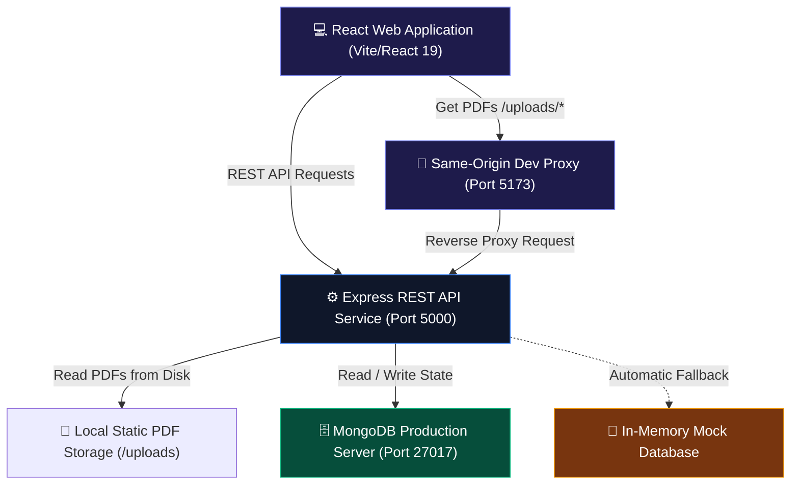
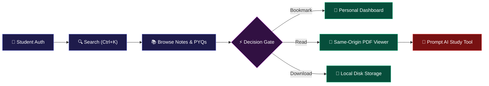
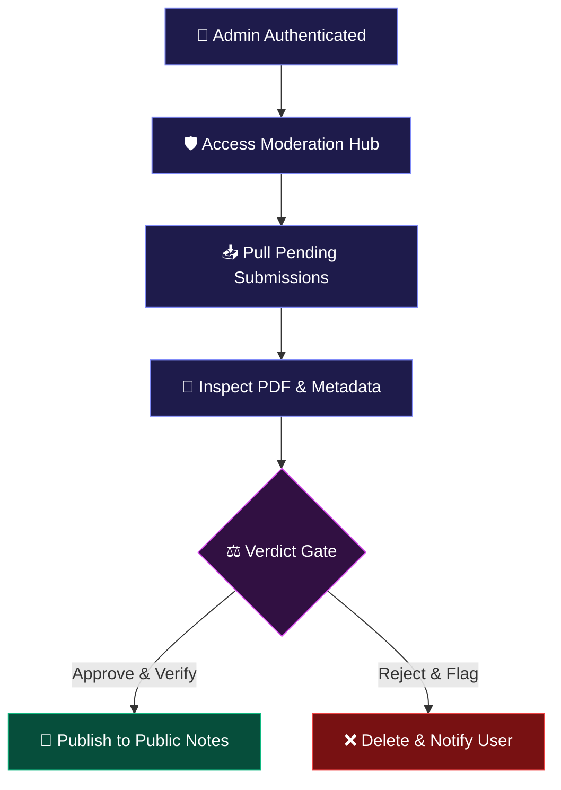

<div align="center">
  
  <!-- Sleek Premium Logo Container -->
  <div style="padding: 24px; background: linear-gradient(135deg, #090b11 0%, #111827 50%, #1e1b4b 100%); border: 1px solid rgba(255, 255, 255, 0.08); border-radius: 28px; display: inline-block; box-shadow: 0 24px 48px -12px rgba(0, 0, 0, 0.6); margin-bottom: 24px;">
    <svg width="84" height="84" viewBox="0 0 24 24" fill="none" xmlns="http://www.w3.org/2000/svg">
      <path d="M12 2L2 7L12 12L22 7L12 2Z" fill="url(#logo-grad)" stroke="#818cf8" stroke-width="1.5" stroke-linejoin="round"/>
      <path d="M2 17L12 22L22 17" stroke="#a78bfa" stroke-width="1.5" stroke-linecap="round" stroke-linejoin="round"/>
      <path d="M2 12L12 17L22 12" stroke="#c084fc" stroke-width="1.5" stroke-linecap="round" stroke-linejoin="round"/>
      <defs>
        <linearGradient id="logo-grad" x1="2" y1="2" x2="22" y2="12" gradientUnits="userSpaceOnUse">
          <stop offset="0%" stop-color="#4f46e5"/>
          <stop offset="50%" stop-color="#8b5cf6"/>
          <stop offset="100%" stop-color="#d946ef"/>
        </linearGradient>
      </defs>
    </svg>
  </div>

  # TechVault
  ### Premium Engineering Knowledge Vault & Study Platform

  <p align="center">
    A state-of-the-art, secure, and collaborative ecosystem designed to help engineering students archive, discover, and master notes, previous year question papers (PYQs), and academic syllabus resources.
  </p>

  <!-- Developer/Startup Badges -->
  <p align="center">
    <a href="https://react.dev"></a>
    <a href="https://vite.dev"></a>
    <a href="https://nodejs.org"></a>
    <a href="https://expressjs.com"></a>
    <br/>
    <a href="https://mongodb.com"></a>
    <a href="https://tailwindcss.com"></a>
    <a href="https://jwt.io"></a>
    <a href="https://opensource.org/licenses/MIT"></a>
  </p>

  <sub>Built with ❤️ for JECRC Foundation & engineering branches under the RTU syllabus framework.</sub>
</div>

---

## 📖 Table of Contents

- [🎨 Interface Preview](#-interface-preview)
- [⚡ Key Features](#-key-features)
- [🛠️ Engineering Highlights](#%EF%B8%8F-engineering-highlights)
- [💻 Tech Stack](#-tech-stack)
- [📐 Architecture Overview](#-architecture-overview)
- [📁 Folder Structure](#-folder-structure)
- [⚙️ Installation Guide](#%EF%B8%8F-installation-guide)
- [🔐 Environment Configuration](#-environment-configuration)
- [🔄 User Workflows](#-user-workflows)
- [🛡️ Security Features](#%EF%B8%8F-security-features)
- [🎨 UI/UX Philosophy](#-uiux-philosophy)
- [📅 Product Roadmap](#-product-roadmap)
- [🤝 Contributing](#-contributing)
- [📜 License](#-license)

---

## 🎨 Interface Preview

Here is a visual walk-through of the premium TechVault client experience:

### 1. Portal Landing & Entry
> [!NOTE]
> A dark, engineering-inspired landing grid featuring ambient lighting effects and responsive call-to-actions.

<p align="center">
  
</p>

### 2. Dashboard Workspace Overview
> [!TIP]
> The personalized student hub displaying bookmarks, upload impact analytics, and active HSTS-bypassed syllabus shortcuts.

<p align="center">
  
</p>

### 3. Integrated PDF Document Viewer
> [!IMPORTANT]
> The same-origin document reader which dynamically displays actual lecture notes and PYQs, complete with an AI study tool side-drawer.

<p align="center">
  
</p>

---

## ⚡ Key Features

TechVault is designed with a card-style functional interface structure:

<table width="100%">
  <tr>
    <td width="50%" valign="top">
      <h4>🔍 Spotlight Search (Ctrl + K)</h4>
      <p>Global navigation & index lookup palette enabling instantaneous document search, autocomplete recommendations, and comprehensive keyboard shortcuts.</p>
    </td>
    <td width="50%" valign="top">
      <h4>⚡ AI Study Assistant</h4>
      <p>Interactive client-side sidecar summarizing uploaded notes, drafting contextual study flashcards, and generating quiz reviews dynamically.</p>
    </td>
  </tr>
  <tr>
    <td width="50%" valign="top">
      <h4>📑 Same-Origin PDF Streaming</h4>
      <p>Seamless document rendering with zoom controls, orientation switches, same-origin static routing, and high-performance local downloads.</p>
    </td>
    <td width="50%" valign="top">
      <h4>📚 RTU Syllabus Restructuring</h4>
      <p>Structured academic grids built around JECRC / RTU engineering courses, facilitating fast navigation between semester syllabi and materials.</p>
    </td>
  </tr>
  <tr>
    <td width="50%" valign="top">
      <h4>🛡️ Role & Permission Matrix</h4>
      <p>State-guarded operations dividing access models cleanly into Student contributors, Moderation queues, and Platform Administrators.</p>
    </td>
    <td width="50%" valign="top">
      <h4>📊 Admin Moderation & Metrics</h4>
      <p>Full operations dashboard showing incoming upload queues and interactive download analytics generated via native inline SVG diagrams.</p>
    </td>
  </tr>
</table>

---

## 🛠️ Engineering Highlights

Designed with professional development best practices, this repository highlights several critical backend and frontend integrations:

*   **Vite Proxy Tunneling**: Bypassed local document frame blocks and HSTS issues by configuring development-level server-proxies to serve static files securely from backend directories under the same origin.
*   **Fail-Safe Mock Database Integration**: Built a robust DB connection handler that automatically triggers in-memory seed data generation when MongoDB connectivity fails, ensuring complete sandbox availability.
*   **Stateless REST Architecture**: Used cryptographically signed JWT payloads for clean authorization sequences, preventing unauthorized operations on private administrative endpoints.
*   **Aesthetic Performance Focus**: Created responsive glassmorphism styles through Tailwind CSS v4 and managed smooth micro-animations using Framer Motion 12 without impacting client-side bundles.

---

## 💻 Tech Stack

### Frontend Architecture
| Technology | Role | Description |
| :--- | :--- | :--- |
| **React 19** | Core Library | UI rendering with strict state management hooks. |
| **Vite 8** | Build Orchestrator | Instant hot module replacement and lightning-fast compilation. |
| **Tailwind CSS 4** | Visual Styling | Curated styling systems with modern dark layouts. |
| **Framer Motion 12** | Interface Animation | Smooth drawer reveals, flip animations, and fade-ins. |
| **Lucide React** | Icon Library | Minimal, crisp vector icons tailored for dark interfaces. |

### Backend API Service
| Technology | Role | Description |
| :--- | :--- | :--- |
| **Node.js** | Runtime Environment | High-performance asynchronous execution engine. |
| **Express.js** | Web Framework | Lightweight API router, middleware container, and asset server. |
| **MongoDB & Mongoose**| Persistent Database | Schematized data stores with secure model validations. |
| **JSON Web Tokens** | Session Security | Stateless client verification via request headers. |
| **Multer** | Multipart Handler | Dedicated file system writer for PDF storage. |
| **Helmet & CORS** | Security Middleware | Origin validation, iframe restrictions, and HSTS control. |

---

## 📐 Architecture Overview



---

## 📁 Folder Structure

```text
TechVault-main/
├── backend/                  # Express API Server Code
│   ├── uploads/              # Static PDF store (Curriculum notes & PYQs)
│   ├── src/
│   │   ├── config/           # DB Connections and Mock Database seeds
│   │   ├── controllers/      # Route request handler logic
│   │   ├── middlewares/      # JWT guards, validation, and error handlers
│   │   ├── models/           # Mongoose schemas (User, Note, PYQ, Review)
│   │   ├── routes/           # API router entry endpoints
│   │   └── server.js         # Backend server startup config
│   ├── package.json
│   └── .env                  # Backend credentials setup
├── src/                      # Vite + React Frontend Application
│   ├── components/           # Reusable components (PDFViewer, SearchPalette)
│   ├── context/              # Central state engine (AppContext)
│   ├── pages/                # SPA views (Auth, Landing, Notes, Dashboard)
│   ├── App.jsx               # Layout engine and main routing
│   └── main.jsx
├── dist/                     # Optimized production bundle
├── public/                   # Frontend assets
├── index.html
├── vite.config.js            # Vite configuration & server proxy rules
└── package.json
```

---

## ⚙️ Installation Guide

Follow these steps to spin up a local instance of the TechVault platform:

### 1. Clone the repository
```bash
git clone https://github.com/shaaannn7/TechVault.git
cd TechVault-main
```

### 2. Setup environment variables
Initialize your environment file from the provided template:
```bash
cp backend/.env.example backend/.env
```

### 3. Install dependencies
Install required node modules in both the frontend (root) and backend directories:
```bash
# Install frontend packages
npm install

# Install backend packages
cd backend && npm install
cd ..
```

### 4. Run in Development Mode
Start both development environments concurrently using separate terminals:
```bash
# Terminal 1: Client Application (Starts http://localhost:5173)
npm run dev

# Terminal 2: API Service (Starts http://localhost:5000)
cd backend && npm run dev
```

---

## 🔐 Environment Configuration

Create a `.env` file under the `/backend` folder with these values:

```env
# Network parameters
PORT=5000
NODE_ENV=development

# Frontend location for CORS origins
FRONTEND_URL=http://localhost:5173

# Database configuration (Defaults to local Mongo server)
MONGODB_URI=mongodb://localhost:27017/techvault

# Security configuration (Use a strong hash for secrets)
JWT_SECRET=super_secure_vault_secret_token_1001

# Rate limiting window setup (15 mins in milliseconds)
RATE_LIMIT_WINDOW_MS=900000
RATE_LIMIT_MAX_REQUESTS=100
```

---

## 🔄 User Workflows

### Student Navigation Flow


### Admin Moderation Flow


---

## 🛡️ Security Features

*   **Token Authentication**: JSON Web Tokens (JWT) signed with HMAC SHA-256 for stateless session handling.
*   **Role-Based Security (RBAC)**: API routes are guarded by roles (`admin`, `moderator`, `user`). Users cannot access admin stats or upload moderation endpoints without validated privileges.
*   **Brute-Force Mitigation**: Endpoint-specific rate limiting (`express-rate-limit`) limits clients to 100 requests per 15-minute window.
*   **Iframe Security Override**: Helmet HSTS headers are dynamically set to `max-age=0` with `cross-origin` resource sharing enabled to support secure development loading of local PDF frames.

---

## 🎨 UI/UX Philosophy

*   **Sleek Dark Theme**: High contrast colors using a `#060814` background base combined with neon violet accents.
*   **Minimal Glassmorphism**: Clean structural cards using thin semi-transparent borders (`border-white/5`) and background blur effects.
*   **Micro-interactions**: Hover expansions, logo loading delays, and custom 3D card flips that enrich the learning process.

---

## 📅 Product Roadmap

- [x] RTU 1st Year Syllabus Restructuring
- [x] Authentic Local PDF copies integration (Physics, Chemistry, Maths, BEE, BCE, BME)
- [x] Same-Origin local file proxying
- [ ] Multi-subject PDF indexing search
- [ ] Active Discussion forums for each note card
- [ ] Integration with cloud storage (AWS S3 / Cloudinary PDF backups)
- [ ] Real-time study rooms with WebRTC

---

## 🤝 Contributing

We welcome contributions to TechVault! To contribute:
1. Fork the repository.
2. Create a feature branch: `git checkout -b feature/amazing-feature`.
3. Commit your changes: `git commit -m "feat: add amazing feature"`.
4. Push to the branch: `git push origin feature/amazing-feature`.
5. Open a Pull Request.

---

## 📜 License

Distributed under the MIT License. See [LICENSE](LICENSE) for more information.

---

## 🧑‍💻 Author

**Shaan**
*   GitHub: [@shaaannn7](https://github.com/shaaannn7)
*   Institution: JECRC Foundation (RTU Syllabus Node)
