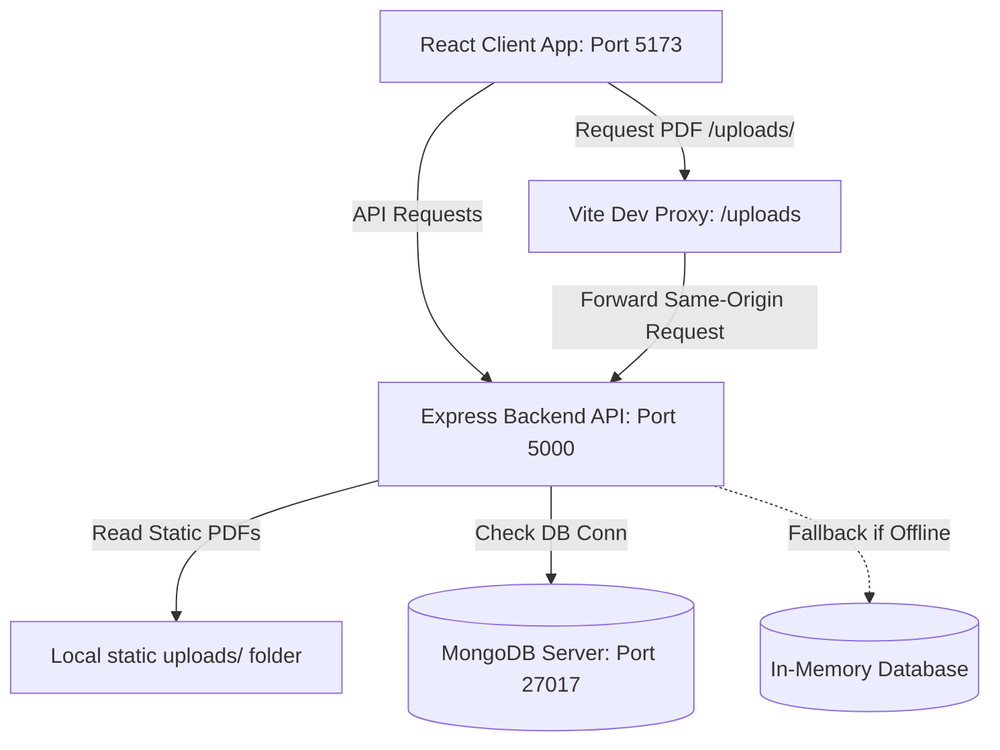
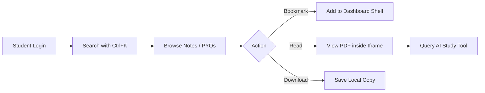
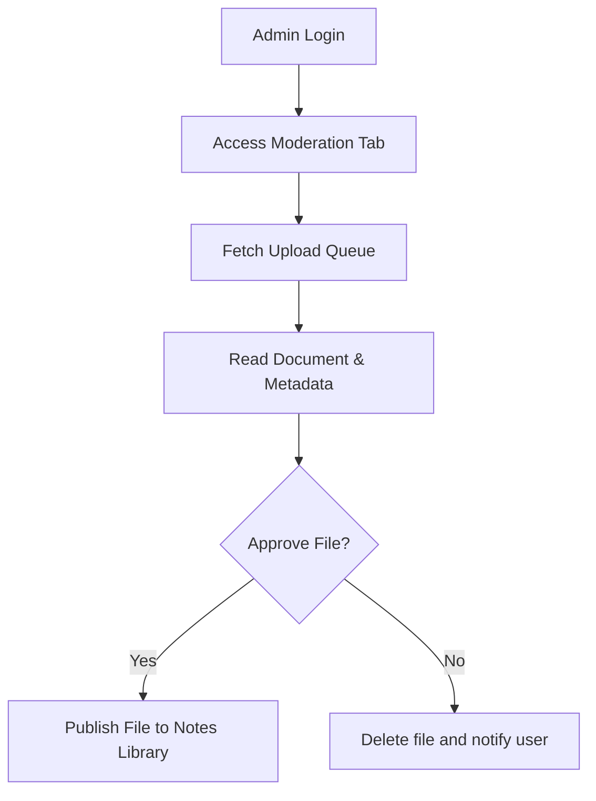

<div align="center">
  
  <!-- Logo -->
  <div style="padding: 20px; background: linear-gradient(135deg, #6366f1 0%, #3b82f6 100%); border-radius: 24px; display: inline-block; margin-bottom: 20px;">
    <svg width="80" height="80" viewBox="0 0 24 24" fill="none" xmlns="http://www.w3.org/2000/svg">
      <path d="M12 2L2 7L12 12L22 7L12 2Z" fill="white" stroke="white" stroke-width="2" stroke-linejoin="round"/>
      <path d="M2 17L12 22L22 17" stroke="white" stroke-width="2" stroke-linecap="round" stroke-linejoin="round"/>
      <path d="M2 12L12 17L22 12" stroke="white" stroke-width="2" stroke-linecap="round" stroke-linejoin="round"/>
    </svg>
  </div>

  # TechVault
  ### Premium Engineering Knowledge Vault & Study Platform

  <p align="center">
    A state-of-the-art, secure, and collaborative ecosystem designed to help engineering students archive, discover, and master notes, previous year question papers (PYQs), and academic syllabus resources.
  </p>

  <!-- Badges -->
  <div>
    
    
    
    
    
    <br/>
    
    
    
  </div>

  <sub>Built with ❤️ for JECRC Foundation & engineering branches under the RTU syllabus framework.</sub>
</div>

---

## 🎨 Interface Preview

Here is a visual walk-through of the premium TechVault client experience:

### 1. Portal Landing & Entry
> [!NOTE]
> A dark, engineering-inspired landing grid featuring ambient lighting effects and responsive call-to-actions.


### 2. Dashboard Workspace Overview
> [!TIP]
> The personalized student hub displaying bookmarks, upload impact analytics, and active HSTS-bypassed syllabus shortcuts.


### 3. Integrated PDF Document Viewer
> [!IMPORTANT]
> The same-origin document reader which dynamically displays actual lecture notes and PYQs, complete with an AI study tool side-drawer.


---

## 🚀 Key Features

### 🎓 Student Features
*   **🔍 Spotlight Search (Ctrl + K)**: A global search palette that provides instant suggestions and keyboard navigation for files.
*   **📚 Subject & Semester Filtering**: Strictly structured to align with the RTU 1st Year Common Syllabus, allowing quick access across semesters 1 and 2.
*   **📑 Inline PDF Viewer**: An interactive viewer that supports zoom, rotation, same-origin document streaming, and direct local downloads.
*   **🔖 Workspace Bookmarks**: Save reference notes to your personalized dashboard with instant distribution metrics.
*   **⚡ AI Study Assistant**: Automatically synthesizes summaries, custom study flashcards (3D flip), and interactive quizzes from documents.

### 🛡️ Admin & Moderation Features
*   **📈 Dashboard Analytics**: Track user contributions and document download counts using custom SVG bar charts.
*   **🕵️ Moderation Queue**: Admin interface to approve, flag, or reject student uploads before they go public.
*   **👥 Role & Access Management**: Control user settings, assign roles (Admin, Moderator, Student), and toggle account permissions.

### ⚙️ Platform Features
*   **🔐 Stateless Authentication**: Secure token verification via HTTP headers (`Authorization: Bearer <token>`).
*   **💾 Hybrid Database Architecture**: Full MongoDB integration with an automatic fallback to in-memory mock databases when offline.
*   **🌐 Same-Origin Proxying**: Development-level Vite proxy to route files statically, eliminating HSTS and iframe blockages.

---

## 💻 Tech Stack

### Frontend Architecture
| Technology | Role | Description |
| :--- | :--- | :--- |
| **React 19** | Core Framework | Single-page architecture with state-driven renders. |
| **Vite 8** | Build Tool | Super-fast compilation and Hot Module Replacement (HMR). |
| **Tailwind CSS 4** | Styling | Curated dark mode color schemes and modern grid systems. |
| **Framer Motion 12** | Animation | Logo entrance reveals, text fade-ups, and smooth modal slides. |
| **Lucide React** | Iconography | High-quality UI icons. |

### Backend API Service
| Technology | Role | Description |
| :--- | :--- | :--- |
| **Node.js** | Runtime | Efficient server-side Javascript execution. |
| **Express.js** | API Framework | Routing endpoints, global error-handling, and static serving. |
| **MongoDB / Mongoose** | Database | Persisted collections for users, notes, PYQs, and reviews. |
| **JSON Web Tokens (JWT)** | Authorization | Stateless sessions with token decoding. |
| **Multer** | Storage Engine | Node multipart file handler for static uploads. |
| **Helmet & CORS** | Security | Request protection and origin whitelist management. |

---

## 📐 Architecture Overview



---

## 📁 Folder Structure

```text
TechVault-main/
├── backend/                  # Express API Server Code
│   ├── uploads/              # Static PDF store (Curriculum notes & PYQs)
│   ├── src/
│   │   ├── config/           # DB Connections and Mock Database seeds
│   │   ├── controllers/      # Route request handler logic
│   │   ├── middlewares/      # JWT guards, validation, and error handlers
│   │   ├── models/           # Mongoose schemas (User, Note, PYQ, Review)
│   │   ├── routes/           # API router entry endpoints
│   │   └── server.js         # Backend server startup config
│   ├── package.json
│   └── .env                  # Backend credentials setup
├── src/                      # Vite + React Frontend Application
│   ├── components/           # Reusable components (PDFViewer, SearchPalette)
│   ├── context/              # Central state engine (AppContext)
│   ├── pages/                # SPA views (Auth, Landing, Notes, Dashboard)
│   ├── App.jsx               # Layout engine and main routing
│   └── main.jsx
├── dist/                     # Optimized production bundle
├── public/                   # Frontend assets
├── index.html
├── vite.config.js            # Vite configuration & server proxy rules
└── package.json
```

---

## ⚙️ Installation Guide

### 1. Clone the repository
```bash
git clone https://github.com/shaaannn7/TechVault.git
cd TechVault-main
```

### 2. Setup environment variables
Create a `.env` file in the `backend/` directory:
```bash
cp backend/.env.example backend/.env
```

### 3. Install dependencies
Run npm installs in both root and backend directories:
```bash
# Install frontend packages
npm install

# Install backend packages
cd backend && npm install
cd ..
```

### 4. Run in Development Mode
Start both development servers concurrently:
```bash
# Terminal 1: Run frontend dev server (Starts on http://localhost:5173)
npm run dev

# Terminal 2: Run backend API service (Starts on http://localhost:5000)
cd backend && npm run dev
```

---

## 🔐 Environment Configuration

Create a `.env` file under the `/backend` folder with these values:

```env
# Network parameters
PORT=5000
NODE_ENV=development

# Frontend location for CORS origins
FRONTEND_URL=http://localhost:5173

# Database configuration (Defaults to local Mongo server)
MONGODB_URI=mongodb://localhost:27017/techvault

# Security configuration (Use a strong hash for secrets)
JWT_SECRET=super_secure_vault_secret_token_1001

# Rate limiting window setup (15 mins in milliseconds)
RATE_LIMIT_WINDOW_MS=900000
RATE_LIMIT_MAX_REQUESTS=100
```

---

## 🔄 User Workflows

### Student Navigation Flow


### Admin Moderation Flow


---

## 🛡️ Security Features
*   **Token Authentication**: JSON Web Tokens (JWT) signed with HMAC SHA-256 for stateless session handling.
*   **Role-Based Security (RBAC)**: API routes are guarded by roles (`admin`, `moderator`, `user`). Users cannot access admin stats or upload moderation endpoints without validated privileges.
*   **Brute-Force Mitigation**: Endpoint-specific rate limiting (`express-rate-limit`) limits clients to 100 requests per 15-minute window.
*   **Iframe Security Override**: Helmet HSTS headers are dynamically set to `max-age=0` with `cross-origin` resource sharing enabled to support secure development loading of local PDF frames.

---

## 🎨 UI/UX Philosophy
*   **Sleek Dark Theme**: High contrast colors using a `#060814` background base combined with neon violet accents.
*   **Minimal Glassmorphism**: Clean structural cards using thin semi-transparent borders (`border-white/5`) and background blur effects.
*   **Micro-interactions**: Hover expansions, logo loading delays, and custom 3D card flips that enrich the learning process.

---

## 📅 Product Roadmap

- [x] RTU 1st Year Syllabus Restructuring
- [x] Authentic Local PDF copies integration (Physics, Chemistry, Maths, BEE, BCE, BME)
- [x] Same-Origin local file proxying
- [ ] Multi-subject PDF indexing search
- [ ] Active Discussion forums for each note card
- [ ] Integration with cloud storage (AWS S3 / Cloudinary PDF backups)
- [ ] Real-time study rooms with WebRTC

---

## 🤝 Contributing

We welcome contributions to TechVault! To contribute:
1. Fork the repository.
2. Create a feature branch: `git checkout -b feature/amazing-feature`.
3. Commit your changes: `git commit -m "feat: add amazing feature"`.
4. Push to the branch: `git push origin feature/amazing-feature`.
5. Open a Pull Request.

---

## 📜 License

Distributed under the MIT License. See [LICENSE](LICENSE) for more information.

---

## 🧑‍💻 Author

**Shaan**
*   GitHub: [@shaaannn7](https://github.com/shaaannn7)
*   Institution: JECRC Foundation (RTU Syllabus Node)
